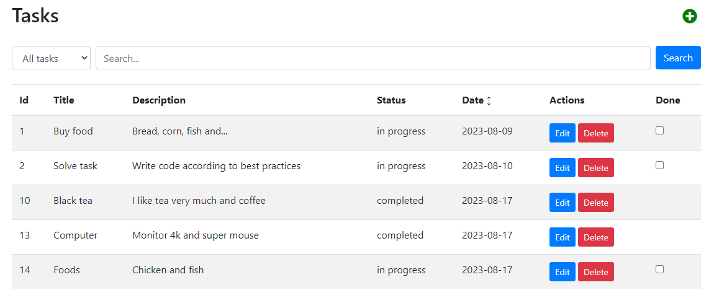

# Task Master

Web application for task management. The design pattern is MVC (Model-View-Controller).

## Technologies

- PHP 8.2
- MySQL 8.0.34
- Bootstrap v5.3.1, CSS, JavaScript

## Possibilities

- Database connection
- CRUD operations (create, read, update, delete)
- Automatic date

### Advanced Features
- Filter tasks by status
- Search for specific tasks
- Sort tasks by their creation date
- Mark tasks as completed

## Usage

To start managing your tasks, you need to set up the run configuration in the IDE and start the server.

The site will be accessible at `http://localhost:8000` in your browser.

The development used the built-in PhpStorm server, so to run on Apache or nginx, create a .htaccess file.